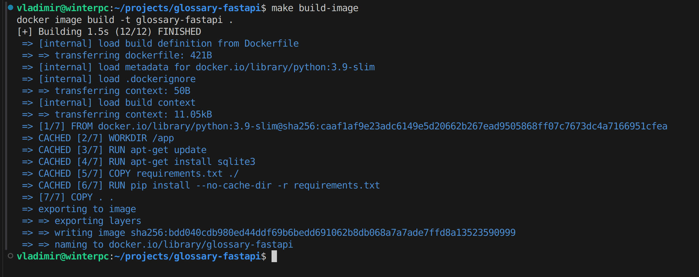
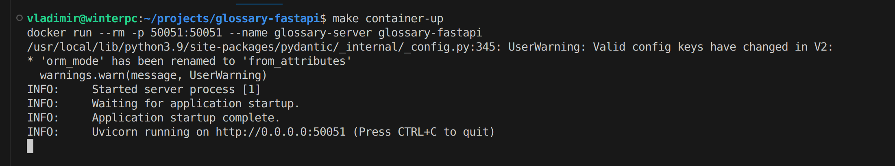
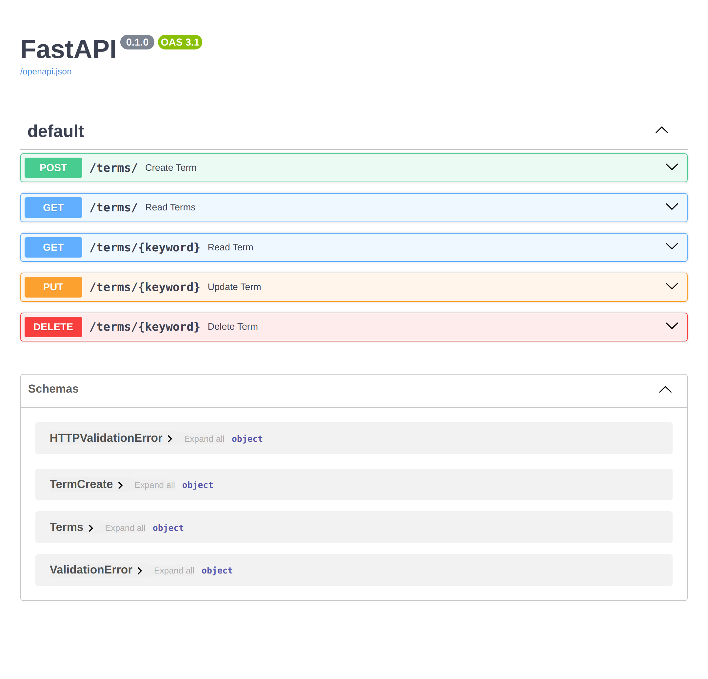

# Развёртывание

## Локальное развёртывание

### Pre-requisites

- make (Unix-builtin)
- python v3.x.x

### Шаги

- `make install` - устанавливаем зависимости
- `make run-server` - поднимаем сервер

Можно ознакомиться с авто-сгенерированной документацией API по адресу `localhost:50051`

## Docker-развёртывание

### Pre-requisites

- Docker
- make (Unix-builtin)
- python v3.x.x

### Шаги

- `make build-image` - собираем образ
- `make container-up` - поднимаем контейнер

Можно ознакомиться с авто-сгенерированной документацией API по адресу `localhost:50051`

# Результат

Собираем образ:

Поднимаем контейнер:

Смотрим документацию:
